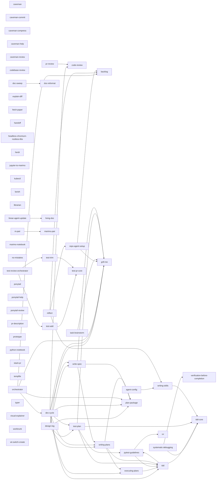

# Agent config

Shared configuration for Claude Code, Codex, Opencode, Pi, Goose, Antigravity, and no-mistakes. Source lives in `~/gitrepos/agent-config`; native homes retain sessions, credentials, caches, and local settings.

## Setup

```bash
git clone --recurse-submodules git@github-haydeni0:Haydeni0/agent-config.git ~/gitrepos/agent-config
cd ~/gitrepos/agent-config
uv tool install --editable ./settings-sync
mkdir -p ~/.config/agent-config
printf 'source = "%s/gitrepos/agent-config"\n' "$HOME" > ~/.config/agent-config/config.toml
agent-config sync
agent-config check
agent-config doctor
```

For an existing installation, follow [Migrate an existing machine](docs/migrate-existing-installation.md). The [first machine's migration record](docs/migration.md) contains its recovery details. `--source /path/to/checkout` works before the local pointer exists. Source selection is explicit flag, `AGENT_CONFIG_REPO`, then `$XDG_CONFIG_HOME/agent-config/config.toml`. Unconfigured source is an error.

## Everyday commands

```bash
agent-config sync                         # local configuration and links
agent-config sync codex                   # one harness
agent-config sync codex agents-md         # one output
agent-config check                       # read-only drift check
agent-config doctor                      # paths, source/link health, host availability
agent-config bootstrap pi                # explicit external installation
agent-config bootstrap --dry-run         # show selected installed hosts
bash scripts/verify.sh                    # same checks as CI
```

`sync [harness] [step]` remains a compatibility command; `sync.sh` invokes bootstrap. Default bootstrap selects installed hosts. no-mistakes installation requires explicit selection because it starts its daemon. Pi/npm/Git and Evo pins are checked against installed versions; web-access uses its lockfile. Dependency changes require refreshing the editable uv tool environment. Lockfile alternative: `uv run --locked --directory settings-sync agent-config`.

## Source layout

| Path | Contents |
|---|---|
| `rules/global.md` | Complete shared instructions |
| `AGENTS.md`, `CLAUDE.md` | Repo editing instructions and Claude loader |
| `harnesses/<harness>/` | Shared native settings and resources |
| `skills/`, `commands/`, `agents/` | Shared agent resources |
| `custom/`, `hooks/` | Hook scripts and pinned plugin submodules |
| `settings-sync/`, `opencode-resume/` | Config CLI and session converter |
| `.agents/plans/` | Machine-local design packages and plans, ignored |
| `.agents/backlog.md` | Local deferred topics, ignored |

Shared edits belong here. Runtime skill/command aliases point back here; generated instructions name this checkout. Mixed JSON/YAML/TOML files merge declared template keys and preserve other native keys. Generated outputs update normally after adoption; local edits conflict. Selected-step force backs up before replacement. Unknown entries survive cleanup. Details: [ownership and recovery](settings-sync/README.md#ownership-and-recovery).

Command hooks share one policy across native adapters. Hook-group sync preserves foreign registrations and local trust. See [hook coverage, tests and recovery](hooks/README.md) for verified hosts and enforcement limits.

Machine-only no-mistakes settings live in `$XDG_CONFIG_HOME/agent-config/overlays/no-mistakes.yaml`. Additional local Claude executable permissions live in `overlays/claude.json` as `permissions.allow`; they append uniquely to shared permissions. Codex trust, hook approvals and UI state remain in its native config. Gemini workspace trust remains native. Secrets stay outside this source checkout.

Shell/editor/OS configuration belongs in the [dotfiles repo](https://github.com/Haydeni0/dotfiles). Shared shell exports belong there; `~/.zshenv` remains machine-local. Add a sync target through one declaration in `settings-sync/settings_sync/registry.py` and its native adapter.

## Updating

Pull this checkout, initialize submodules, then run local sync and check. Update package pins deliberately, then run bootstrap for that harness. Git commit/push follow the user's current authorization gate.

## Typical workflows

> Personal notes. One conversation unless context stale or switching repos.
>
> Single living spec; after Interfaces and Tests grills: `Fold our decisions into the spec. Also, review the spec for consistency after.`

### Feature pipeline

- **Understand** — `Help me plan <feature>. <why> <starter idea> <existing integration surface in repo> /grill-me` — exit: scope, non-goals, key decisions agreed
- **Spec** — `Write a spec from our agreed design. /superpowers:brainstorming` — exit: spec file exists and reviewed
- **Interfaces** — `Help me brainstorm interfaces/classes for this spec. /grill-me` — exit: protocols, classes, module layout agreed — then: spec merge
- **Tests** — `Help me plan tests for this spec before we implement. /grill-me /pytest-guidelines` — exit: public API test strategy agreed — then: spec merge
- **Implement** — `Implement per spec. /tdd` — exit: `tdd_scaffolding/` deleted; behavioral tests pass per `pytest-guidelines`

### Harness config & skill authoring

- **Configure harness / Add skill** - `/agent-config` - single source of truth is the source checkout: edit source in repo -> `agent-config sync <tool>` -> `bash scripts/verify.sh`.

## Skill map

The dependency graph below is generated from each skill's `deps:` frontmatter - regenerate with `uv run --locked --directory settings-sync python ../scripts/check_skill_graph.py --write` after changing deps; verify.sh fails on a stale graph. Strong edges only (directives to load/invoke/run another skill); routing disambiguation pointers are prose, not deps.

<!-- skill-graph: generated by scripts/check_skill_graph.py - do not edit by hand -->


### Roles

FC = format contract (passive on-disk format knowledge) | EL = elicitation | DIS = discipline (rec = when-to-record, proc = process) | PRO = producer | DRV = driver/state machine | EXE = executor | REV = reviewer | CAP = capture | HK = housekeeping | mode = persistent style modifier | catalog = one-shot reference card | ref = tool guide/runbook | wrapper = delegates to another skill

| Skill | Role(s) | Note |
|---|---|---|
| agent-config | FC + ref | authoring/portability rules + sync runbook |
| backlog | CAP | recall recommends next item |
| caveman | mode | vendored |
| caveman-commit | PRO | commit message |
| caveman-compress | EXE | vendored |
| caveman-help | catalog | vendored |
| caveman-review | FC | formats review output, judges nothing; vendored |
| code-review | REV | verdict gate |
| codebase-review | REV | structural, no diff |
| design-log | DIS + DRV + HK | when-to-write discipline; orchestrates workers; promote. Format contract moved to plan-package |
| dev-cycle | DRV | stage detection from markers, launch gate, reviewer loop |
| doc-reformat | PRO + REV | guardian pipeline + fresh-context loss auditor |
| doc-sweep | HK + REV | repo-wide retrospective tidy, human-gated |
| executing-plans | EXE | loads plan, executes tasks |
| explain-diff | PRO | HTML/Notion from diff |
| fetch-paper | EXE | fetch + convert + verify |
| grill-me | EL | one fork at a time, decision log |
| handoff | CAP | compaction for next session |
| headless-chromium-rootless-libs | ref | troubleshooting runbook |
| herdr | ref | terminal multiplexer control |
| jupyter-to-marimo | EXE | vendored |
| kubectl | ref + DIS | read-only contract, mutation verbs blocked |
| lavish | ref | delegates to lavish-axi CLI |
| librarian | EXE | research protocol |
| linear-agent-update | FC + DIS | comment templates + format check |
| living-doc | PRO + DIS + EL + HK | evidence-grounded doc; working rules; START interview; FINALISE retire |
| m-pair | wrapper | delegates to marimo-pair |
| marimo-notebook | FC | vendored |
| marimo-pair | EXE | drives live kernel; vendored |
| no-mistakes | DRV + EXE | gates external pipeline |
| orchestrator | DRV | mission waves over units |
| plan-package | FC | the .agents/plans on-disk contract |
| ponytail | mode | build-style ladder |
| ponytail-help | catalog | reference card |
| ponytail-review | REV | over-engineering only |
| pr-description | PRO | PR body from branch diff |
| pr-review | wrapper + DRV-lite | resolves scope, dispatches code-review, writes file |
| prototype | EL + EXE | elicits judgement via throwaway artifact |
| pytest-guidelines | FC + DIS | test-writing standards + red flags |
| python-notebook | FC | `# %%` cell format |
| reflect | HK + EL + EXE | session retro -> durable config |
| repo-agent-setup | DRV + EL + PRO + HK | mode detection, sequential grill, apply, audit |
| stack-pr | DRV + EXE | stack map `.agents/stacks/<slug>.json` |
| systematic-debugging | DIS (proc) | reproduce-first, root-cause discipline |
| task-brainstorm | DRV | TASKS_*.md state file, per-group grill |
| tempfile | CAP | one-shot dump |
| tdd | wrapper + DIS | delegates loop to tdd-core |
| tdd-core | DIS (proc) + FC | red-green loop; good-test canon |
| test-add | REV | coverage-gap proposals |
| test-plan | PRO + FC | drafts scenario plan; heuristics canon; grilling delegated |
| test-pr-core | FC | shared reference |
| test-review-orchestrator | DRV-lite | dispatches trim/add reviewers, merges |
| test-trim | REV | redundancy proposals |
| typer | ref | CLI-authoring rules |
| uv | ref | command rules |
| verification-before-completion | DIS | claim gate |
| visual-explainer | PRO + FC | HTML page + layout invariants |
| worktrunk | ref | vendored |
| write-spec | PRO | spec from settled design |
| writing-plans | PRO + FC | checkbox plan + header/task structure |
| writing-skills | DIS + PRO + FC + REV | TDD-for-skills methodology (meta) |
| wt-switch-create | EXE | vendored |
